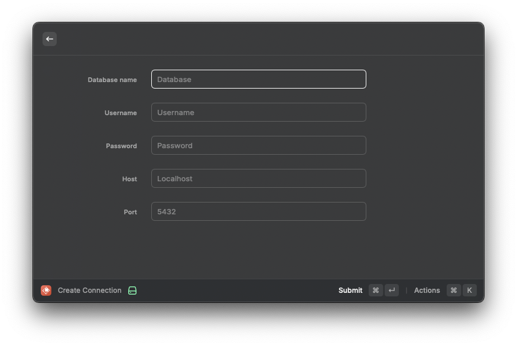
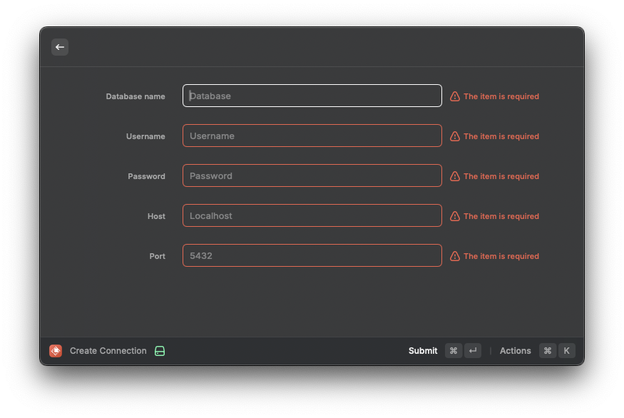
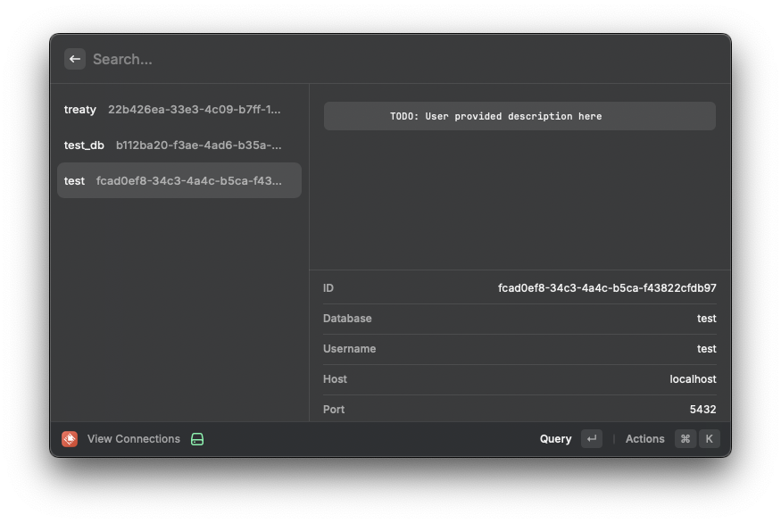
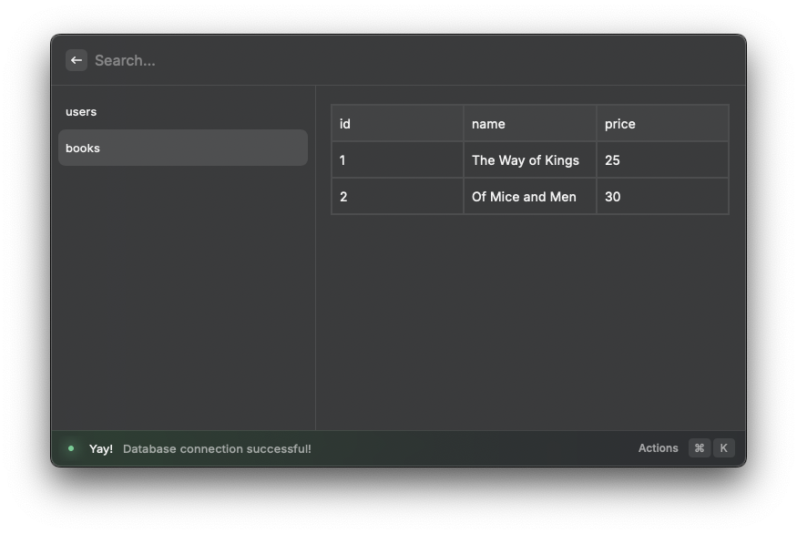
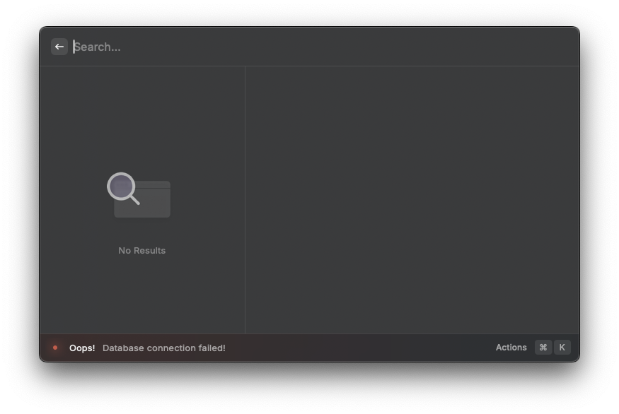

# PostgreSQL

Raycast extension for exploring PostgreSQL databases

# Screenshots

##### Create Connection



##### Create Connection Validation



##### View Connections



##### Query Success



##### Query Fail



# Testing with local database

```
docker run --name test-postgres -e POSTGRES_USER=test_user -e POSTGRES_PASSWORD=test_password -e POSTGRES_DB=test_db -p 5432:5432 -d postgres
```

This command will:

- Create a container named test-postgres.
- Set up a user (test_user) with a password (test_password).
- Create a database named test_db.
- Expose PostgreSQL on the default port 5432.

### Access the Container

```
docker exec -it test-postgres psql -U test_user -d test_db
```

### Create a Sample Table

```
CREATE TABLE users (
    id SERIAL PRIMARY KEY,
    name VARCHAR(50),
    age INT
);
INSERT INTO users (name, age) VALUES ('Alice', 25), ('Bob', 30);

CREATE TABLE books (
    id SERIAL PRIMARY KEY,
    name VARCHAR(50),
    price INT
);

INSERT INTO books (name, price) VALUES ('The Way of Kings', 25), ('Of Mice and Men', 30);
```

```
\q
```

To quit postgres

### Delete container

Get ID

```
docker ps
```

Stop

```
docker stop <ID>
```

```
docker rm <ID>
```
